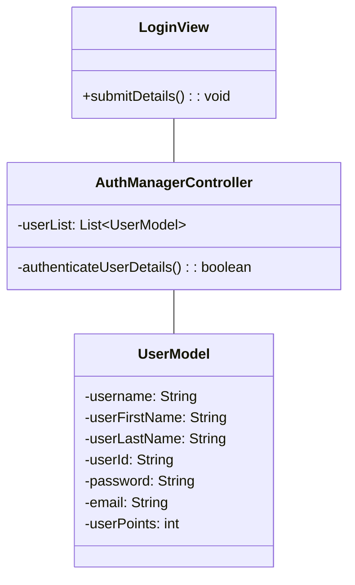
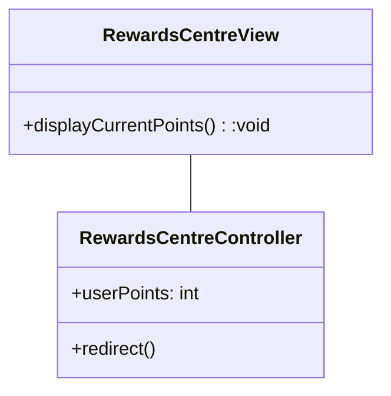
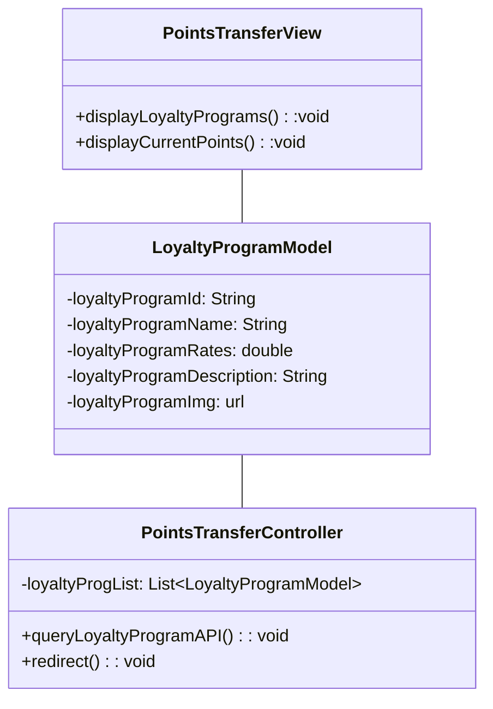
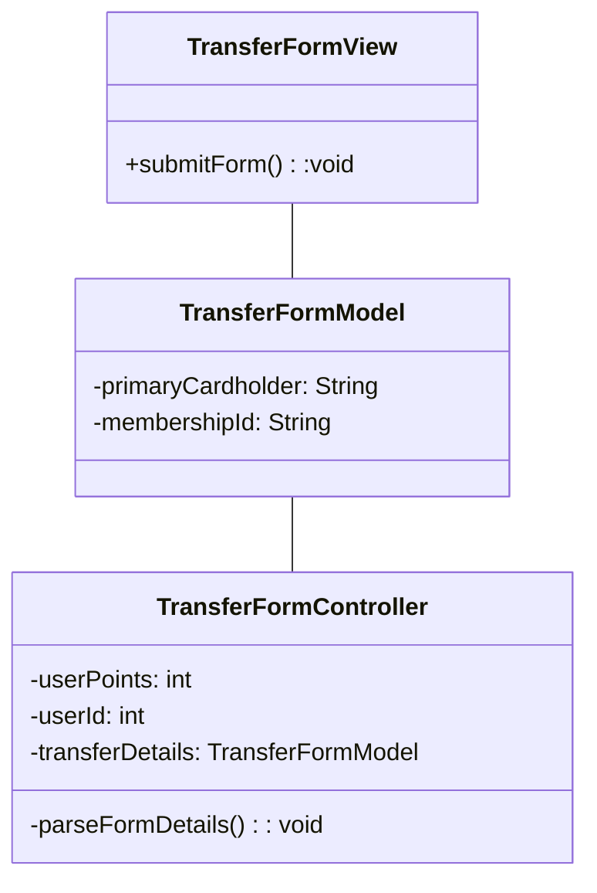
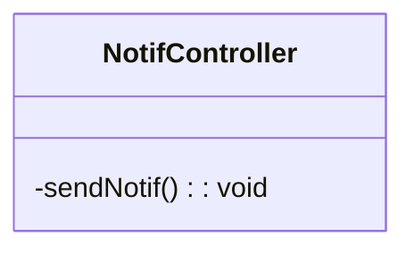
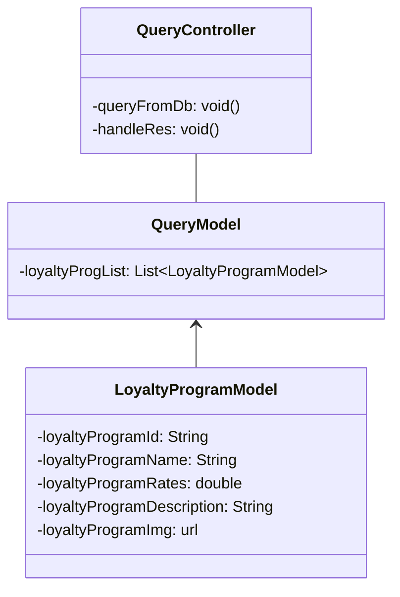
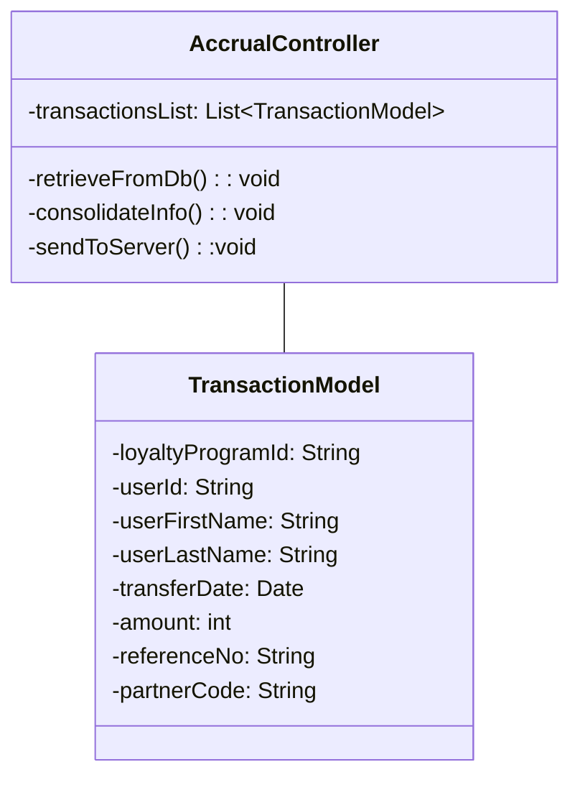
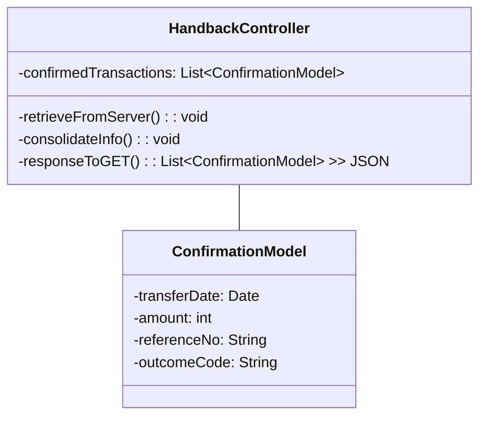

User can:

    View login page
    fill up loginform
    Login with userid n password
    go to rewardscenter view
    view their own points

    go to pointsTransferView 
    - they can look at x number of loyalty programs
    - currency exchange rate
    
    do a credit transfer form
    - fill up credit transfer form
    - enter their lp membership 
    
    submit credit transfer form

    Receive updates (notifs)
    
    
    
# Bank App

### Login 

### RewardsCenter

### PointsTransfer

### CreditTransferForm

### Notification System

# TransferConnect

### Loyalty Program Query

# TransferFile SENDING API

# TransferFile RETRIEVING API

transferconnect receive handback > update outcomecode to each transaction stored in db

